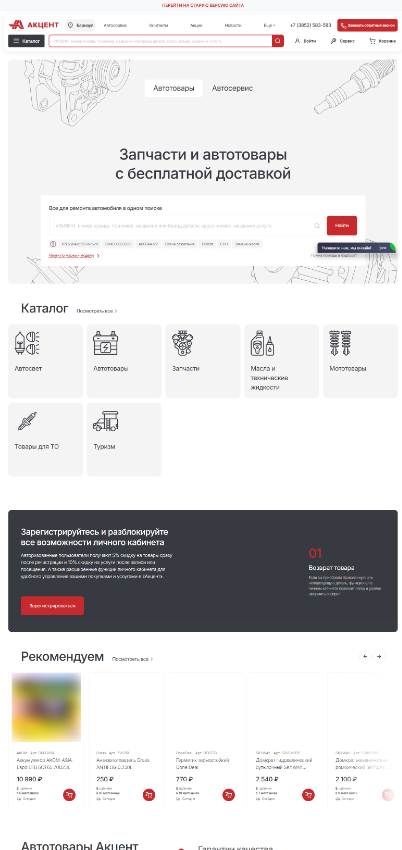
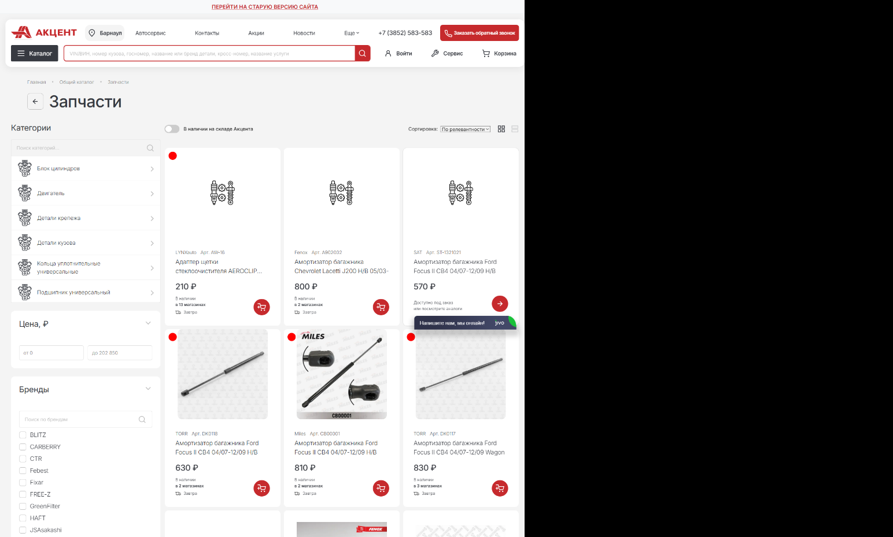
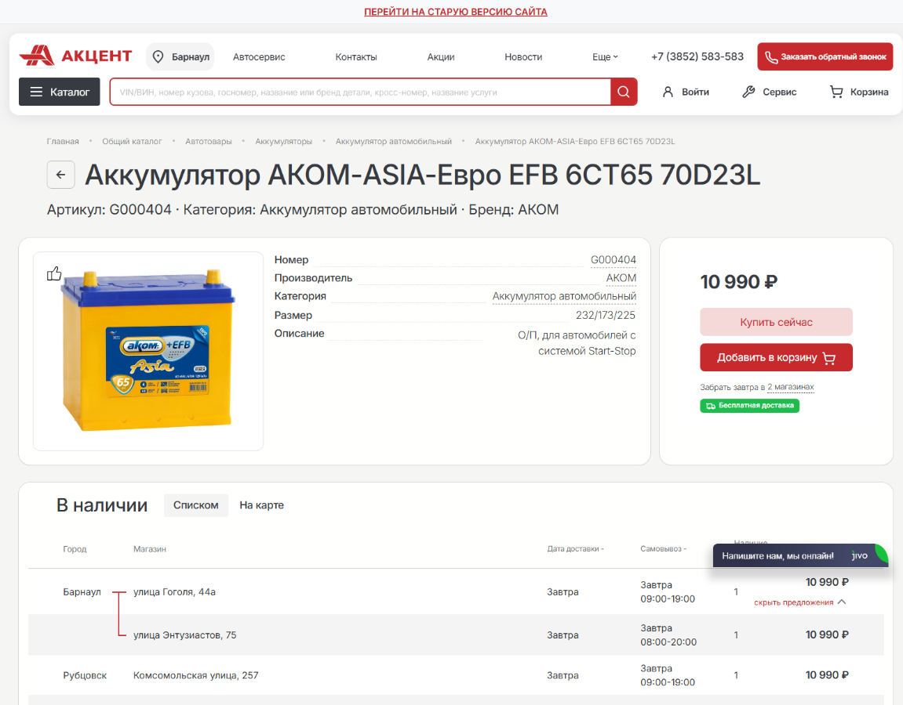
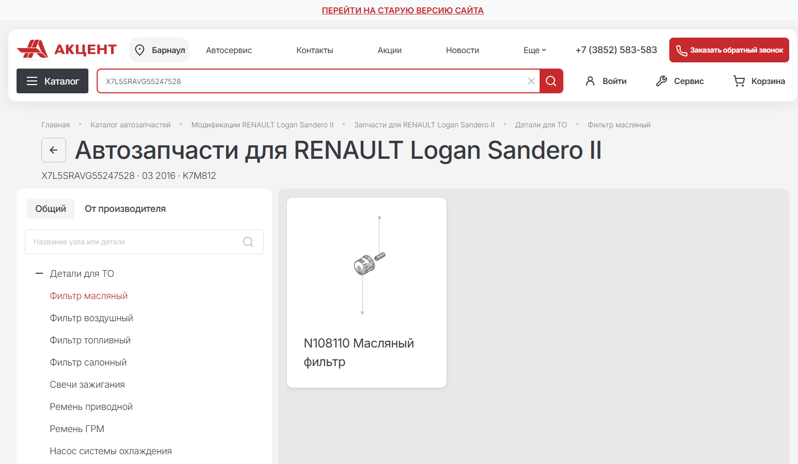
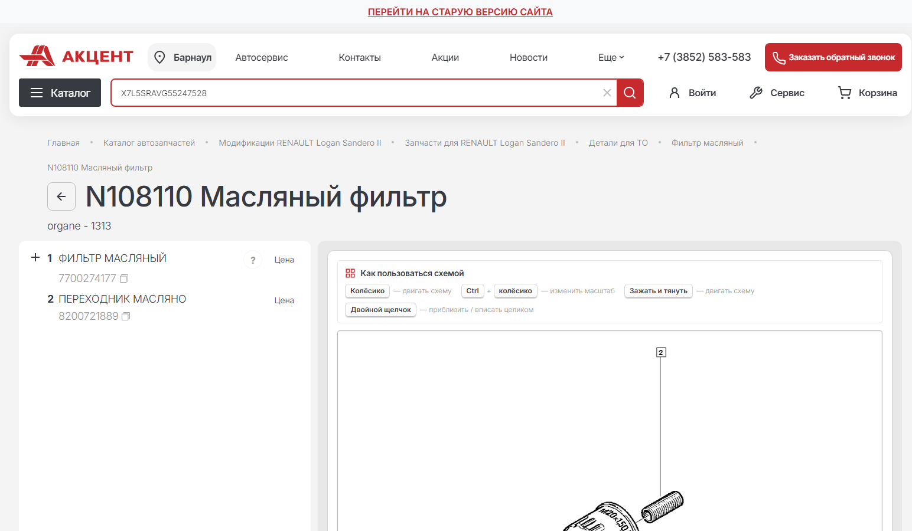

# aa22.ru — Frontend Case Study

Production e-commerce platform for automotive parts and services.

**Role:** Sole Frontend Developer  
**Project:** [aa22.ru](https://aa22.ru)

## Overview

[aa22.ru](https://aa22.ru) is a production e-commerce platform for automotive parts and services. The public product experience includes vehicle-oriented part search, catalog navigation, product pages, store-level availability, delivery and pickup flows, personal account features, promotions and service booking.

The frontend covered a large part of the customer journey: from finding the right part to checking availability and completing a purchase.

## My role

I was the **sole frontend developer** on the project and was responsible for the frontend end-to-end:

- Frontend architecture and application development
- Catalog, product, cart and checkout interfaces
- B2B and B2C purchase flows
- Complex client-side business logic and application state
- Integration with backend REST APIs
- Responsive and adaptive UI across desktop, tablet and mobile
- Refactoring legacy frontend code
- Building reusable UI components
- Performance and UX improvements
- Coordination with backend, design and business teams
- Establishing responsive UI standards for the project

## Key product areas

### Automotive catalog

The platform supports several ways of finding parts, including:

- VIN / vehicle identification
- Vehicle make and model
- Body number
- License plate
- Part name or brand
- Cross-number
- Service search

The catalog also includes advanced filtering and facets for narrowing down a large product selection.

### Product pages

Product interfaces combine product information with commercial data such as:

- Price
- Availability
- Store locations
- Delivery / pickup options
- Related and recommended products

### Vehicle-specific parts

The project includes automotive parts catalogs connected to a specific vehicle, including category navigation and interactive part diagrams.

### Cart and checkout

The frontend includes multi-step checkout flows for both B2C and B2B scenarios, with complex client-side validation, state management and API interactions.

## Integrations

### Laximo

Integration with the Laximo automotive catalog API was used for specialized vehicle and parts data. A significant frontend responsibility was mapping this data into the product and catalog experience.

### Yandex Maps

Yandex Maps API integration was used for delivery-related functionality and pickup-point / store selection.

### Yandex SmartCaptcha

SmartCaptcha was integrated into customer-facing flows that required bot protection.

### Backend REST APIs

The frontend communicates with backend services for catalog data, product information, user flows, checkout and other business operations.

## Technical stack

- React
- Next.js
- TypeScript
- SCSS / CSS Modules
- SSR
- State management / application stores
- REST API
- Laximo API
- Yandex Maps API
- Yandex SmartCaptcha
- Responsive / adaptive UI
- Reusable component-based architecture

## Engineering challenges

### 1. Complex automotive data

Automotive catalog data is more complex than a typical product catalog because products can be related to specific vehicles, configurations and part diagrams.

**Frontend focus:** integrating specialized catalog data and turning it into usable navigation, filtering and product-selection interfaces.

### 2. Large catalog and advanced filtering

The application needed to expose a large product assortment while keeping filtering and navigation understandable.

**Frontend focus:** reusable catalog UI, facets, filtering logic and asynchronous data loading.

### 3. B2B and B2C purchase flows

Different customer scenarios require different business rules and checkout behavior.

**Frontend focus:** multi-step forms, client-side business logic, validation, state management and integration with backend APIs.

### 4. Store-level availability

Products can be available across multiple stores, so the UI needs to connect product information with inventory and delivery / pickup options.

**Frontend focus:** presenting availability and store information as part of the purchase journey.

### 5. Responsive standardization and legacy refactoring

The project included existing frontend code that required refactoring alongside ongoing feature development.

**Frontend focus:** reusable components, responsive standards, consistent UI behavior and gradual modernization of legacy code.

## SEO, performance and UX

The public platform is designed as a production e-commerce site with catalog and product content exposed through the web. Frontend work included performance and UX improvements, responsive behavior, reusable UI patterns and SEO-related requirements.

No private performance metrics are published in this case study.

## Screenshots

The following screenshots are taken from the public production website and show representative frontend scenarios.

### Mobile storefront

### Product catalog and filtering

### Product page and store availability

### Vehicle-specific parts catalog

### Interactive automotive parts diagram

## Result

The frontend provided the customer-facing layer for a production automotive e-commerce platform, covering the main product discovery and purchase flows from vehicle / part search through catalog navigation, product selection, cart and checkout.

The project combined a complex automotive domain with a large consumer-facing catalog, multiple external integrations, responsive UI requirements and ongoing frontend modernization.

## Links

- [Production website — aa22.ru](https://aa22.ru)
- [GitHub profile — pachkatrue](https://github.com/pachkatrue)
